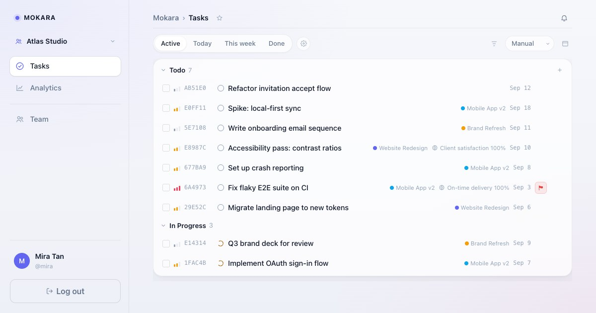

# Mokara — Task Management (v1)



Basic task management web app. pnpm workspace monorepo: Hono (TypeScript) backend sharing the workspace with a Next.js (TypeScript) frontend, plus a Prisma-managed `db` package (schema + migrations + generated client). PostgreSQL + Redis run in Docker; backend and frontend run on the host for fast dev loops.

See [`docs/development/PRD-01.md`](docs/development/PRD-01.md) and [`docs/development/PRD-02.md`](docs/development/PRD-02.md) for the full spec (tasks + auth + teams + invitations).

For the frontend design system (colors, spacing, components, layout patterns), see [`docs/design/system.md`](docs/design/system.md).

## Structure

```
mokara/
├── docker-compose.yml     # postgres + redis ONLY
├── pnpm-workspace.yaml
├── packages/
│   ├── backend/           # Hono + TypeScript REST API (Prisma client)
│   ├── db/                # Prisma: schema.prisma, migrations, seed, generated client
│   └── frontend/          # Next.js (TypeScript) UI
├── .github/workflows/     # CI (runs on dev branch: typecheck, lint, format)
├── .pi/                   # project memory (AGENTS.md) + transient state
└── docs/
    ├── design/            # design system reference
    └── development/        # PRDs
```

## Prerequisites

- **Node.js** 24+ and **pnpm** 11.13 — `npm i -g pnpm@11.13.0` (or Corepack)
- **Docker** + Docker Compose

> No Go, no separate language toolchain. Everything in the workspace is TypeScript.

## Getting started

### 1. Start infrastructure (PostgreSQL + Redis only)

```bash
docker compose up -d
```

### 2. Set up the database (Prisma)

```bash
cp packages/db/.env.example packages/db/.env
pnpm install                  # installs all workspace deps (incl. backend + db + frontend)
pnpm db:migrate:deploy        # apply existing migrations to the DB
pnpm db:generate              # generate the Prisma 7 client into packages/db/prisma/generated
pnpm db:seed                  # inserts sample users + tasks
```

To change the schema: edit `packages/db/prisma/schema.prisma`, then run `pnpm db:migrate` (creates a new migration). For first-time setup of a fresh DB, use `pnpm db:migrate:init` instead of `migrate:deploy`.

### 3. Run the backend

```bash
cp packages/backend/.env.example packages/backend/.env
pnpm dev:backend
# -> http://localhost:4700  (try /health)
```

`@mokara/backend` depends on `@mokara/db` via `workspace:*`, so the Prisma client is shared — no separate codegen for the backend.

### 4. Run the frontend (Next.js)

```bash
cp packages/frontend/.env.example packages/frontend/.env
pnpm dev:frontend
# -> http://localhost:4701
```

### Or run both at once

```bash
pnpm dev
# runs backend + frontend in parallel via `pnpm -r --parallel`
```

## Scripts (root)

| Script                   | What it does                                            |
| ------------------------ | ------------------------------------------------------- |
| `pnpm dev`               | Run backend + frontend in parallel                      |
| `pnpm dev:backend`       | Backend only (`tsx watch src/index.ts` on :4700)        |
| `pnpm dev:frontend`      | Frontend only (`next dev` on :4701)                     |
| `pnpm build:frontend`    | Production build (Next standalone output)               |
| `pnpm start:backend`     | Run the backend as the container does (`tsx`, no watch) |
| `pnpm typecheck`         | `tsc --noEmit` across all workspaces                    |
| `pnpm lint`              | ESLint (frontend only for now)                          |
| `pnpm format`            | Prettier check                                          |
| `pnpm format:fix`        | Prettier write                                          |
| `pnpm db:migrate`        | Prisma `migrate dev` (create + apply new migration)     |
| `pnpm db:migrate:deploy` | Apply existing migrations (production / fresh DB)       |
| `pnpm db:migrate:reset`  | Drop + re-apply all migrations (destructive)            |
| `pnpm db:generate`       | Regenerate the Prisma client                            |
| `pnpm db:seed`           | Run `prisma/seed.ts`                                    |

## API

All routes are mounted under `/api`. Auth uses an HS256 JWT in the `mokara_token` httpOnly cookie (`__Host-mokara_token` in production; same name the frontend `proxy.ts` route guard reads).

### Auth

| Method | Path               | Auth     | Description                |
| ------ | ------------------ | -------- | -------------------------- |
| POST   | `/api/auth/signup` | public   | Create account, set cookie |
| POST   | `/api/auth/login`  | public   | Sign in, set cookie        |
| POST   | `/api/auth/logout` | public   | Clear cookie               |
| GET    | `/api/me`          | required | Current user               |

### Teams

| Method | Path                           | Auth     | Description                           |
| ------ | ------------------------------ | -------- | ------------------------------------- |
| POST   | `/api/teams`                   | required | Create team (creator becomes owner)   |
| GET    | `/api/teams`                   | required | List teams you're a member of         |
| GET    | `/api/teams/:id`               | required | Get team + members + open invites     |
| POST   | `/api/teams/:id/leave`         | required | Leave team (owner can't with members) |
| POST   | `/api/teams/:id/invitations`   | required | Invite a user by username             |
| GET    | `/api/invitations`             | required | List your pending invitations         |
| POST   | `/api/invitations/:id/respond` | required | Accept or decline an invitation       |

### Tasks

| Method | Path                   | Auth     | Description                                 |
| ------ | ---------------------- | -------- | ------------------------------------------- |
| GET    | `/api/teams/:id/tasks` | required | List tasks for a team (`?status=...`)       |
| POST   | `/api/teams/:id/tasks` | required | Create a task in a team                     |
| GET    | `/api/tasks/:id`       | required | Get a task (membership-checked)             |
| PATCH  | `/api/tasks/:id`       | required | Partial update (title, status, priority, …) |
| DELETE | `/api/tasks/:id`       | required | Delete a task                               |
| POST   | `/api/tasks/:id/flag`  | required | Toggle `flagged` for "flag for attention"   |

### Misc

| Method | Path      | Description                                                                                 |
| ------ | --------- | ------------------------------------------------------------------------------------------- |
| GET    | `/health` | Returns `{ "status": "ok" }` (frontend `instrumentation.ts` pings this on boot + every 30s) |

## Release (container images)

Releases are tag-driven; images are built **only** by CI, never on the deploy host.

```bash
git tag v0.1.1 && git push origin v0.1.1
```

The tag must equal `version` in the root `package.json` (and in every workspace
`package.json`) — CI's release gate fails the tag otherwise, which is exactly how
the first `v0.1.1` attempt died on 2026-09-03. Bump the manifests, commit, then
tag.

`.github/workflows/release.yml` gates the tag (typecheck · lint · format · the real
frontend build · every migration applied to an empty Postgres · tag matches
`package.json`), then publishes:

```
ghcr.io/<owner>/mokara-frontend:0.1.1   (+ :0.1, :latest)
ghcr.io/<owner>/mokara-backend:0.1.1    (+ :0.1, :latest)
```

Coolify runs both as **Docker Image** services and pulls them. Full design and the
reasoning behind each choice: `docs/development/PRD-07.md`.

| Service  | Port | Reads                                                                |
| -------- | ---- | -------------------------------------------------------------------- |
| frontend | 4701 | `BACKEND_URL` (runtime — the browser only ever calls `/api`)         |
| backend  | 4700 | `DATABASE_URL`, `REDIS_URL`, `AUTH_SECRET`, `ENV=production`, `PORT` |

The backend container applies pending migrations on start (`packages/backend/
scripts/start.sh`) before the server binds, so it can never come up against a
schema it does not expect. **Rolling back an image does not roll back the
database** — keep each release's migrations additive and deploy the code that uses
them in the same release.

## Notes

- **DB schema + migrations** are managed by **Prisma 7** in `packages/db`. Schema lives in `prisma/schema.prisma`; CLI config (datasource URL, migrations, seed) lives in `prisma.config.ts`. The generated client (`prisma generate`) outputs to `prisma/generated/` (gitignored). The Hono backend imports the client via deep path `@mokara/db/prisma/generated/client` — no separate codegen. Migrations use `prisma migrate` (`migrate dev` locally, `migrate deploy` to apply). Seed runs via `tsx prisma/seed.ts`.
- **Migration workflow contract** — the database only ever changes by applying committed migration SQL, forward-only. `pnpm dev` (and the backend container's start) run `db:bootstrap`: `migrate deploy` (pending applied, already-applied skipped, fail-closed on error — nothing deleted) + `prisma generate`. Editing `schema.prisma` alone is inert. New migrations are dated SQL folders under `prisma/migrations/` (hand-write them; `migrate dev` is interactive and hangs without a TTY). Check state anytime with `pnpm db:status`.
- **Password hashing** is `bcryptjs` (cost 10). The seed file uses Go-compatible `$2a$10$…` hashes; both `bcryptjs` and `golang.org/x/crypto/bcrypt` accept the same format, so seeded users log in unchanged.
- **Auth cookie** is `mokara_token` in dev, `__Host-mokara_token` in production (HS256, httpOnly, SameSite=Lax). The name is environment-gated on both sides: backend `lib/jwt.ts` (`COOKIE_NAME`, on `ENV`) and frontend `lib/cookies.ts` (`AUTH_COOKIE`, on `NODE_ENV`) — keep the two conditions in step, and never pair a prod-built frontend with a backend running `ENV=development`.
- **The 3-member team cap** is enforced by a Postgres trigger (`enforce_max_team_members`) that raises `team_full`. The backend catches this and returns a friendly 409 — same as it does for the partial unique index on pending invitations (`team_invitations_team_pending_unique`).
- **Redis** backs the session-revocation denylist: signing out (or any revocation) marks the token's `jti` invalid server-side until its natural expiry, so a copied cookie stops working the moment the user logs out. Provisioned by docker-compose in dev; production deployments must provide `REDIS_URL` (the backend fails fast at startup and fails closed per-request without it).
- Package Dockerfiles use the repository root as their build context:
  - `docker build -f packages/backend/Dockerfile -t mokara-backend .`
  - `docker build -f packages/frontend/Dockerfile -t mokara-frontend .`
    They are intentionally **not** wired into `docker-compose.yml`.
- Per-package `.env` files are gitignored; only `.env.example` is committed.
- **CI** (`.github/workflows/ci.yml`) runs on push/PR to `dev` only — typecheck, lint, format.
- **Project memory** lives in `.pi/AGENTS.md` (committed). Transient work-in-progress is in `.pi/state.md` (gitignored). The pi agent auto-loads both on session start.
