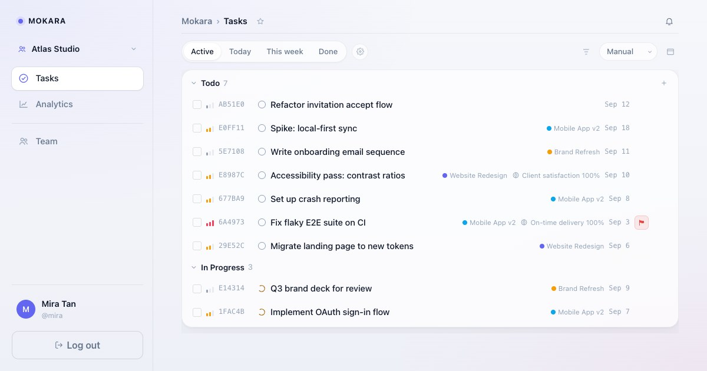

# Mokara — Task Management (v1)



Basic task management web app. pnpm workspace monorepo: Hono (TypeScript) backend sharing the workspace with a Next.js (TypeScript) frontend, plus a Prisma-managed `db` package (schema + migrations + generated client). PostgreSQL + Redis run in Docker; backend and frontend run on the host for fast dev loops.

See [`docs/development/PRD-01.md`](docs/development/PRD-01.md) and [`docs/development/PRD-02.md`](docs/development/PRD-02.md) for the full spec (tasks + auth + teams + invitations).

For the frontend design system (colors, spacing, components, layout patterns), see [`docs/design/system.md`](docs/design/system.md).

## Structure

```
mokara/
├── docker-compose.yml     # postgres + redis ONLY
├── pnpm-workspace.yaml
├── packages/
│   ├── backend/           # Hono + TypeScript REST API (Prisma client)
│   ├── db/                # Prisma: schema.prisma, migrations, seed, generated client
│   └── frontend/          # Next.js (TypeScript) UI
├── .github/workflows/     # CI (runs on dev branch: typecheck, lint, format)
├── .pi/                   # project memory (AGENTS.md) + transient state
└── docs/
    ├── design/            # design system reference
    └── development/        # PRDs
```

## Prerequisites

- **Node.js** 24+ and **pnpm** 11.13 — `npm i -g pnpm@11.13.1` (or Corepack)
- **Docker** + Docker Compose

> No Go, no separate language toolchain. Everything in the workspace is TypeScript.

## Getting started

### 1. Start infrastructure (PostgreSQL + Redis only)

```bash
docker compose up -d
```

### 2. Set up the database (Prisma)

```bash
cp packages/db/.env.example packages/db/.env
pnpm install                  # installs all workspace deps (incl. backend + db + frontend)
pnpm db:migrate:deploy        # apply existing migrations to the DB
pnpm db:generate              # generate the Prisma 7 client into packages/db/prisma/generated
pnpm db:seed                  # inserts sample users + tasks
```

To change the schema: edit `packages/db/prisma/schema.prisma`, then run `pnpm db:migrate` (creates a new migration). For first-time setup of a fresh DB, use `pnpm db:migrate:init` instead of `migrate:deploy`.

### 3. Run the backend

```bash
cp packages/backend/.env.example packages/backend/.env
pnpm dev:backend
# -> http://localhost:4700  (try /health)
```

`@mokara/backend` depends on `@mokara/db` via `workspace:*`, so the Prisma client is shared — no separate codegen for the backend.

### 4. Run the frontend (Next.js)

```bash
cp packages/frontend/.env.example packages/frontend/.env
pnpm dev:frontend
# -> http://localhost:4701
```

### Or run both at once

```bash
pnpm dev
# runs backend + frontend in parallel via `pnpm -r --parallel`
```

## Scripts (root)

| Script                   | What it does                                            |
| ------------------------ | ------------------------------------------------------- |
| `pnpm dev`               | Run backend + frontend in parallel                      |
| `pnpm dev:backend`       | Backend only (`tsx watch src/index.ts` on :4700)        |
| `pnpm dev:frontend`      | Frontend only (`next dev` on :4701)                     |
| `pnpm build:frontend`    | Production build (Next standalone output)               |
| `pnpm start:backend`     | Run the backend as the container does (`tsx`, no watch) |
| `pnpm typecheck`         | `tsc --noEmit` across all workspaces                    |
| `pnpm lint`              | ESLint (frontend only for now)                          |
| `pnpm format`            | Prettier check                                          |
| `pnpm format:fix`        | Prettier write                                          |
| `pnpm db:migrate`        | Prisma `migrate dev` (create + apply new migration)     |
| `pnpm db:migrate:deploy` | Apply existing migrations (production / fresh DB)       |
| `pnpm db:migrate:reset`  | Drop + re-apply all migrations (destructive)            |
| `pnpm db:generate`       | Regenerate the Prisma client                            |
| `pnpm db:seed`           | Run `prisma/seed.ts`                                    |

## API

All routes are mounted under `/api`. Auth uses an HS256 JWT in the `mokara_token` httpOnly cookie (`__Host-mokara_token` in production; same name the frontend `proxy.ts` route guard reads).

### Auth

| Method | Path               | Auth     | Description                |
| ------ | ------------------ | -------- | -------------------------- |
| POST   | `/api/auth/signup` | public   | Create account, set cookie |
| POST   | `/api/auth/login`  | public   | Sign in, set cookie        |
| POST   | `/api/auth/logout` | public   | Clear cookie               |
| GET    | `/api/me`          | required | Current user               |

### Teams

| Method | Path                           | Auth     | Description                           |
| ------ | ------------------------------ | -------- | ------------------------------------- |
| POST   | `/api/teams`                   | required | Create team (creator becomes owner)   |
| GET    | `/api/teams`                   | required | List teams you're a member of         |
| GET    | `/api/teams/:id`               | required | Get team + members + open invites     |
| POST   | `/api/teams/:id/leave`         | required | Leave team (owner can't with members) |
| POST   | `/api/teams/:id/invitations`   | required | Invite a user by username             |
| GET    | `/api/invitations`             | required | List your pending invitations         |
| POST   | `/api/invitations/:id/respond` | required | Accept or decline an invitation       |

### Tasks

| Method | Path                   | Auth     | Description                                 |
| ------ | ---------------------- | -------- | ------------------------------------------- |
| GET    | `/api/teams/:id/tasks` | required | List tasks for a team (`?status=...`)       |
| POST   | `/api/teams/:id/tasks` | required | Create a task in a team                     |
| GET    | `/api/tasks/:id`       | required | Get a task (membership-checked)             |
| PATCH  | `/api/tasks/:id`       | required | Partial update (title, status, priority, …) |
| DELETE | `/api/tasks/:id`       | required | Delete a task                               |
| POST   | `/api/tasks/:id/flag`  | required | Toggle `flagged` for "flag for attention"   |

### Misc

| Method | Path      | Description                                                                                 |
| ------ | --------- | ------------------------------------------------------------------------------------------- |
| GET    | `/health` | Returns `{ "status": "ok" }` (frontend `instrumentation.ts` pings this on boot + every 30s) |

## Release (container images)

Production releases are tag-driven; staging images are published on pushes to
`dev`. Images are built **only** by CI, never on the deploy host.
Use the release script to update every workspace manifest and release example,
then commit and tag that version:

```bash
pnpm release:bump patch
git commit -am "chore(release): 0.2.0"
git tag v0.2.0 && git push origin v0.2.0
```

The tag must equal `version` in the root `package.json` and every workspace
`package.json`. CI runs the script's synchronization check and fails the tag if
any manifest or release reference disagrees, which is exactly how the first
`v0.1.1` attempt died on 2026-09-03.

`.github/workflows/release.yml` gates the tag (typecheck · lint · format · the real
frontend build · every migration applied to an empty Postgres · synchronized
release version matches the tag), then publishes:

```
ghcr.io/<owner>/mokara-frontend:0.2.0   (+ :0.2, :latest)
ghcr.io/<owner>/mokara-backend:0.2.0    (+ :0.2, :latest)
ghcr.io/<owner>/mokara-admin:0.2.0      (+ :0.2, :latest)
```

Coolify runs all three as **Docker Image** services and pulls them. Full design and
the reasoning behind each choice: `docs/development/PRD-07.md`.

| Service  | Port | Reads                                                                                                                |
| -------- | ---- | -------------------------------------------------------------------------------------------------------------------- |
| frontend | 4701 | `BACKEND_URL` (runtime — the browser only ever calls `/api`)                                                         |
| backend  | 4700 | `DATABASE_URL`, `REDIS_URL`, `AUTH_SECRET`, `ENV=production`, `PORT`                                                 |
| admin    | 4702 | `BACKEND_URL`, `ADMIN_PORT`, `ENV=production`, `ADMIN_TOKEN_SECRET`, `ADMIN_URL_KEY` (both must equal the backend's) |

The backend additionally reads `DEPLOY_MODE`, the `S3_*` storage block, the
`STRIPE_*` billing block and the four `ADMIN_*` console values — each is
optional and documented in `packages/backend/.env.example`, which is the env
contract for a self-hosted deploy.

The backend container applies pending migrations on start (`packages/backend/
scripts/start.sh`) before the server binds, so it can never come up against a
schema it does not expect. **Rolling back an image does not roll back the
database** — keep each release's migrations additive and deploy the code that uses
them in the same release.

## Staging (`dev` images + Coolify)

No release tag or version bump is required for staging. A push to `dev` runs
`.github/workflows/ci.yml`: typecheck, lint, format, the standalone frontend
build, and migrations against an empty disposable Postgres database. Only after
those checks pass does it publish all three images:

```text
ghcr.io/<owner>/mokara-frontend:dev
ghcr.io/<owner>/mokara-backend:dev
ghcr.io/<owner>/mokara-admin:dev
```

Each image also receives `:dev-<full-commit-sha>`, so a specific build can be
selected for testing or rollback. Pull requests run checks but **never publish**.
This pipeline never writes `latest` or the production version tags; the existing
version-tag release workflow is unchanged.

### Coolify setup

Create a separate staging environment with these **Docker Image** services on
the same internal Docker network:

| Service  | Image tag | Domain                | Container port |
| -------- | --------- | --------------------- | -------------- |
| frontend | `dev`     | `dev.mokara.my`       | 4704           |
| backend  | `dev`     | `dev-api.mokara.my`   | 4703           |
| admin    | `dev`     | `dev-admin.mokara.my` | 4705           |

The dev workflow passes `APP_PORT` to each Dockerfile. Dev images actually
listen on and expose the ports above; production builds retain their defaults
of backend 4700, frontend 4701, and admin 4702.

In Coolify, set **Ports Exposes** to the service's dev port. If using host ports
for a Cloudflare Tunnel, set matching **Ports Mappings**: backend `4703:4703`,
frontend `4704:4704`, and admin `4705:4705`. Update only the dev tunnel origins to
those ports, keeping the appropriate origin hostname for your tunnel setup.
Remove or update any existing Coolify `PORT`/`ADMIN_PORT` overrides pointing at
4700–4702; runtime environment variables override the image's defaults.

Point those domains at the Coolify server and enable HTTPS. Supply registry
credentials in Coolify if the GHCR packages are private. Publishing images does
**not** redeploy Coolify: wait for all three image jobs to succeed, then manually
redeploy all three staging services so they pull the new images. If any image
job fails, do not deploy a mixed set; retry the failed publication first. For a
fixed test build, use the same `dev-<full-commit-sha>` tag on all three services.
Image publication is not atomic across services, and rolling back images does
not roll back migrations.

Backend runtime settings:

```dotenv
PORT=4703
ENV=production
```

Frontend runtime settings:

```dotenv
PORT=4704
BACKEND_URL=http://<dev-backend-internal-host>:4703
NEXT_PUBLIC_SITE_URL=https://dev.mokara.my
```

Admin runtime settings:

```dotenv
BACKEND_URL=http://<dev-backend-internal-host>:4703
ADMIN_PORT=4705
ENV=production
```

Replace `<dev-backend-internal-host>` with the staging backend's actual internal
Coolify hostname/network alias, **not** its public domain. The browser continues
to call `/api` on `dev.mokara.my`; it does not call `dev-api.mokara.my` directly.
Normal frontend/admin proxy use does not require cross-origin CORS settings.

### Production versus staging environment variables

The environment **mode** is the same, but the environment **values** are not:

| Setting                 | Staging requirement                                                               |
| ----------------------- | --------------------------------------------------------------------------------- |
| `NODE_ENV`              | Keep `production` (already set in the images).                                    |
| Backend/admin `ENV`     | Set `production` on both; HTTPS cookies must match the production-built client.   |
| `PORT` / `ADMIN_PORT`   | Backend `PORT=4703`, frontend `PORT=4704`, admin `ADMIN_PORT=4705`.               |
| `DEPLOY_MODE`           | Match the behaviour being tested; use `hosted` to test hosted plan limits.        |
| `DATABASE_URL`          | Separate staging database and credentials; never the production database.         |
| `REDIS_URL`             | Separate staging Redis instance.                                                  |
| `AUTH_SECRET`           | Fresh staging-only secret, at least 32 characters.                                |
| `ADMIN_*`               | Staging-only credentials and secrets; shared keys must match within staging.      |
| `S3_*`                  | Separate staging bucket and access credentials.                                   |
| `STRIPE_*`              | Test-mode API key, test price, and a separate test webhook secret—or leave unset. |
| `NEXT_PUBLIC_SITE_URL`  | `https://dev.mokara.my`.                                                          |
| `GITHUB_CALLBACK_URL`   | `https://dev.mokara.my/api/integrations/github/callback`, if enabled.             |
| `GITHUB_PUBLIC_APP_URL` | `https://dev.mokara.my`, if enabled.                                              |

For the admin console, set all four backend `ADMIN_*` values. Copy the staging
backend's `ADMIN_TOKEN_SECRET` and `ADMIN_URL_KEY` into the staging admin
service, **not** the production values. Use a separate GitHub App for staging if
testing that integration; production callbacks and credentials should not be
repurposed. Optional storage, billing, and GitHub integrations can remain
unconfigured until needed. No production secrets belong in workflow files.

## Notes

- **DB schema + migrations** are managed by **Prisma 7** in `packages/db`. Schema lives in `prisma/schema.prisma`; CLI config (datasource URL, migrations, seed) lives in `prisma.config.ts`. The generated client (`prisma generate`) outputs to `prisma/generated/` (gitignored). The Hono backend imports the client via deep path `@mokara/db/prisma/generated/client` — no separate codegen. Migrations use `prisma migrate` (`migrate dev` locally, `migrate deploy` to apply). Seed runs via `tsx prisma/seed.ts`.
- **Migration workflow contract** — the database only ever changes by applying committed migration SQL, forward-only. `pnpm dev` (and the backend container's start) run `db:bootstrap`: `migrate deploy` (pending applied, already-applied skipped, fail-closed on error — nothing deleted) + `prisma generate`. Editing `schema.prisma` alone is inert. New migrations are dated SQL folders under `prisma/migrations/` (hand-write them; `migrate dev` is interactive and hangs without a TTY). Check state anytime with `pnpm db:status`.
- **Password hashing** is `bcryptjs` (cost 10). The seed file uses Go-compatible `$2a$10$…` hashes; both `bcryptjs` and `golang.org/x/crypto/bcrypt` accept the same format, so seeded users log in unchanged.
- **Auth cookie** is `mokara_token` in dev, `__Host-mokara_token` in production (HS256, httpOnly, SameSite=Lax). The name is environment-gated on both sides: backend `lib/jwt.ts` (`COOKIE_NAME`, on `ENV`) and frontend `lib/cookies.ts` (`AUTH_COOKIE`, on `NODE_ENV`) — keep the two conditions in step, and never pair a prod-built frontend with a backend running `ENV=development`.
- **The 3-member team cap** is enforced by a Postgres trigger (`enforce_max_team_members`) that raises `team_full`. The backend catches this and returns a friendly 409 — same as it does for the partial unique index on pending invitations (`team_invitations_team_pending_unique`).
- **Redis** backs the session-revocation denylist: signing out (or any revocation) marks the token's `jti` invalid server-side until its natural expiry, so a copied cookie stops working the moment the user logs out. Provisioned by docker-compose in dev; production deployments must provide `REDIS_URL` (the backend fails fast at startup and fails closed per-request without it).
- Package Dockerfiles use the repository root as their build context:
  - `docker build -f packages/backend/Dockerfile -t mokara-backend .`
  - `docker build -f packages/frontend/Dockerfile -t mokara-frontend .`
    They are intentionally **not** wired into `docker-compose.yml`.
- Per-package `.env` files are gitignored; only `.env.example` is committed.
- **CI** (`.github/workflows/ci.yml`) runs checks, the frontend build, and empty-database migrations on push/PR to `dev`. Successful pushes additionally publish all three `dev` images; PRs never publish.
- **Project memory** lives in `.pi/AGENTS.md` (committed). Transient work-in-progress is in `.pi/state.md` (gitignored). The pi agent auto-loads both on session start.
