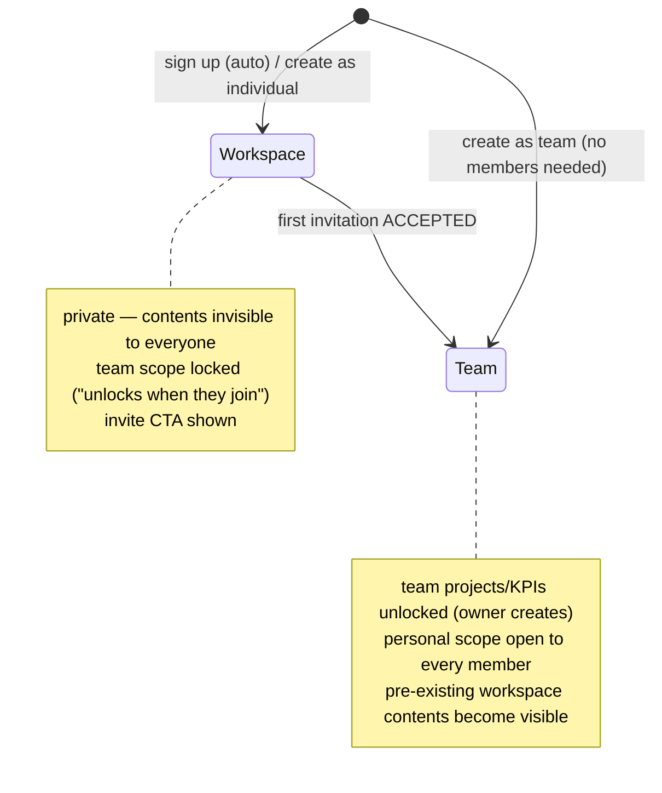
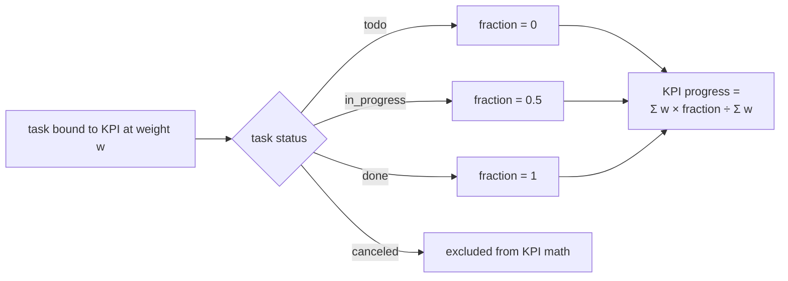

# PRD-06: Workspaces, Teams, Projects & KPIs

> Status: **BUILT & AUDITED** — phases 1–3 plus the §11 gap list all landed on
> 2026-09-02; 4 migrations, still uncommitted. §11 is the done/partial list; the
> only open item is the deliberately deferred project detail screen. Items marked
> ⚑ are recommended defaults the owner has not explicitly vetoed.

## 1. Overview

Mokara gains two organizational layers: **Projects** (grouping) and **KPIs**
(measurement, weighted). Every user gets a private **workspace** by default;
a workspace **becomes a team** when an invite is accepted, which unlocks the
owner-managed _team_ layer. Inside a team, members also keep **personal**
projects/KPIs that everyone can see (Linear-style transparency), so a dev's
and a marketer's work sit side by side with the team's official targets.

There is **no linking** between projects/KPIs and no cross-container
references. Comparing a team project to a member's personal project is done
by eye, on one screen.

## 2. Vocabulary

| Term                   | Meaning                                                                                                                    |
| ---------------------- | -------------------------------------------------------------------------------------------------------------------------- |
| Container              | The existing `Team` table. Has `kind`: `"workspace"` or `"team"`.                                                          |
| Workspace              | Container with 1 member. Private — contents invisible to everyone else. A user can own/join several.                       |
| Team                   | Container with 2+ members (or created explicitly as a team). Has an owner ("team leader").                                 |
| Team project           | `scope: "team"` — created by the owner, shared, the official layer. **Projects only — KPIs have no team scope.**           |
| Personal project / KPI | Projects: `scope: "personal"`. **KPIs are always personal** — created by any member, visible to all, owned by its creator. |

### The layers at a glance

A team container with both layers, plus a separate private workspace:

```text
rekabytes (team)                         abu's "Side Hustle" (workspace)
├── TEAM LAYER                           └── everything private to abu
│   ├── owner-created                        ├── Project: Flutter experiments
│   ├── visible to all, anyone binds         └── KPI: Ship v1
│   ├── Project: WebApp
│   └── KPI: Ship on time
├── PERSONAL LAYER (one set per member)
│   ├── abu → Project: Marketing Push · KPI: Get 10 leads
│   └── siti → Project: Design System · KPI: Pixel perfect
└── TASKS — each binds ≤1 project + N KPIs (weight %)
```

### Container lifecycle

Two birth paths (creation modal), one growth path (invite accepted), no way
back — a container that was ever a team stays a team:



## 3. Decisions (settled with owner)

1. **Solo = workspace, not a special account.** One container model; `kind`
   flips. No role-upgrade machinery, no user-scoped tables. (Adopted "A".)
2. **Personal workspace is created server-side at signup**, plus a one-time
   backfill for pre-existing accounts that had no container at all
   (`20260902150000_personal_workspace_backfill` — seeded invite-only users).
   The frontend boot keeps a fallback. Invariant now holds in the DB: every
   user has ≥ 1 container.
3. **Invite CTA** is shown in workspace mode ("Mokara is better with your
   team — invite up to 2 more").
4. **Three visibility tiers, no linking**: team scope (owner-created),
   personal scope in a team (visible to all members), workspace contents
   (private). Workspaces can never be linked to teams or to each other.
5. **Team projects unlock only in `kind: team` containers and are owner-only,
   permanently** (even in a trusted 3-person team). **Amended 2026-09-02: KPIs
   are individual-only** — no team-scope KPIs; any member creates their own,
   because a KPI measures a person, and collective delivery is already the
   project's own progress.
6. **Linear-style binding**: any member can bind tasks to _any_ project/KPI in
   the container — including someone else's personal ones. Visibility implies
   bindability.
7. **Transition is one-way and acceptance-gated**: workspace → team on the
   first **accepted** invitation. Never converts back (even if members leave).
   Creating a container as a "team" from the start (modal) is `kind: team`
   immediately, no members needed.
8. **No manual convert button.** The container switcher only switches and
   creates (modal asks individual vs team). The only workspace→team path is
   invite + accept.

## 4. Data model

```prisma
model Team {
  // existing fields; plus:
  kind String @default("team") // "workspace" | "team"
}

model Project {
  id       String   @id @default(dbgenerated("gen_random_uuid()")) @db.Uuid
  teamId   String   @map("team_id") @db.Uuid
  ownerId  String   @map("owner_id") @db.Uuid   // creator
  scope    String   @default("personal")        // "team" | "personal"
  name     String
  color    String?
  archived Boolean  @default(false)
  createdAt DateTime @default(now()) @map("created_at") @db.Timestamptz(3)
  updatedAt DateTime @updatedAt @map("updated_at") @db.Timestamptz(3)
  // relations: team, owner, tasks
  @@index([teamId, scope])
}

model Kpi {
  id        String   @id @default(dbgenerated("gen_random_uuid()")) @db.Uuid
  teamId    String   @map("team_id") @db.Uuid
  ownerId   String   @map("owner_id") @db.Uuid
  name      String
  createdAt DateTime @default(now()) @map("created_at") @db.Timestamptz(3)
  updatedAt DateTime @updatedAt @map("updated_at") @db.Timestamptz(3)
  @@index([teamId])
}

model TaskKpi {
  taskId String @map("task_id") @db.Uuid
  kpiId  String @map("kpi_id") @db.Uuid
  weight Int    // percent, 1–100
  @@id([taskId, kpiId])
  // relations: task (cascade), kpi (cascade)
}

model Task {
  // existing fields; plus:
  projectId String? @map("project_id") @db.Uuid
}
```

Rules encoded in the routes (not triggers):

- **Projects** with `scope: "team"` require a `kind: "team"` container + owner
  role → else 403 `team_scope_forbidden` / `owner_only`. KPIs have no scope and
  are created by any member (owner in a workspace).
- `parent`-style linking does not exist (deliberately dropped).
- Weight is on the **binding** (`TaskKpi.weight`), not the KPI — one task can
  carry several KPIs, each with its own weight.

### Weight math

KPI progress = `Σ(weight × fraction) / Σ(weight)` over its **non-canceled**
bound tasks, where `fraction: todo=0, in_progress=0.5, done=1` (constants in
code; canceled tasks are excluded). Computed at query time. Sums are surfaced
in the UI, not enforced:

- per-task total across KPIs: **enforced ≤ 100** server-side (409
  `kpi_weight_exceeded`) — "this task is 40% A + 30% B" must not exceed a task.
- per-KPI total across tasks: **not enforced** — partial weighting is a
  legitimate state; the picker shows "85% of 100% assigned".

How one task's weight flows into a KPI number:



Concretely: KPI with three bound tasks at 50% / 30% / 20% — one done, one in
progress, one todo → progress = (50×1 + 30×0.5 + 20×0) / 100 = **65%**.

## 5. API

Team-scoped, membership-gated like every existing route. snake_case via
`lib/types.ts` mappers (`toProject`, `toKpi`).

```
GET    /api/teams                       → adds kind, member_count per container
POST   /api/teams                       → { name, kind }  (workspace|team)
GET    /api/teams/:id/projects          → hides archived unless ?all=1
POST   /api/teams/:id/projects          { name, color?, scope }   scope=team → owner only
GET    /api/projects/:id                → detail + tasks
PATCH  /api/projects/:id                { name?, color?, archived? }  creator or team owner
DELETE /api/projects/:id                → hard delete if no tasks, else archives (200)
GET    /api/teams/:id/kpis
POST   /api/teams/:id/kpis              { name }                  any member — KPIs are personal
PATCH  /api/kpis/:id                    { name }                  creator or team owner
DELETE /api/kpis/:id                    → 409 kpi_in_use if bindings exist
PUT    /api/tasks/:id/kpis              [{ kpi_id, weight }]      replace-all binding set
GET    /api/teams/:id/kpis/progress     → per-KPI weighted progress (phase 3)
```

Task create accepts optional `project_id` **and** `kpis: [{ kpi_id, weight }]`
(so the new-task modal can bind in one round-trip); task PATCH accepts
`project_id` only — bindings always go through the replace-all `PUT`. Every
task response carries `project_id` + `kpis: [{ kpi_id, name, weight }]`, so the
client can swap whole task objects without losing chips.

Invitation accept: inside the accept transaction, if the container is
`kind: "workspace"` → flip to `kind: "team"`.

New error codes (each gets an `ERROR_RULES` row): `team_scope_forbidden`,
`owner_only`, `kpi_in_use`, `kpi_weight_exceeded`, `kpi_not_found`. Out-of-range
weights (1–100) arrive as plain `invalid_input` from Zod — no separate code.

## 6. Permission matrix

| Action                        | Workspace (solo)            | Team member            | Team owner              |
| ----------------------------- | --------------------------- | ---------------------- | ----------------------- |
| Create team-scope project     | — (n/a)                     | ✗                      | ✓                       |
| Create KPI (personal, always) | ✓                           | ✓                      | ✓                       |
| Create personal project/KPI   | ✓ (only scope)              | ✓                      | ✓                       |
| Bind task ↔ project/KPI       | ✓ (own container)           | ✓ any in container     | ✓                       |
| Edit/delete personal item     | ✓                           | creator only           | ✓ (leader may moderate) |
| Edit/delete team item         | —                           | ✗                      | ✓                       |
| Invite members                | ✓ (flips to team on accept) | ✓ (existing behaviour) | ✓                       |

## 7. Frontend

- **Page roles**: `/tasks` is the **only** surface where tasks are created and
  tracked (quick-add, modal, drawer, chips). The container page is management
  only — members, invites, projects/KPIs layers with counts. It has **no task
  list and no add-task form** (removed 2026-09-02 by owner decision: it
  duplicated the tasks page, and its quick-add couldn't set projects/KPIs, so
  it produced unbound tasks).

- **Container switcher**: lists every container the user is in — workspaces
  (lock icon, labelled "private") and teams (people icon, labelled "N members")
  — plus "New workspace / team" opening the creation modal, which asks
  **individual or team**; team is `kind: team` from birth, empty of members.
- **Workspace mode**: headings read "My Projects" / "My KPIs", an invite CTA
  card explains the flip, and the team-scope controls are replaced by a 🔒
  "unlocks when they join" line (acceptance-gated).
- **Task modal / drawer**: `Project` chip (folder icon, single-select, grouped
  **Team** / **Personal** with the owner's username on personal entries, colour
  dot, "No project") and `KPIs` chip (multi-select, per-KPI weight inputs, live
  "Σ% of 100%" meter that turns red over budget). Bindings persist via the
  drawer's PATCH-on-change pattern; the KPI set replaces wholesale via
  `PUT /tasks/:id/kpis`.
- **Task rows**: project colour dot + name, and `KPI name 40%` markers.
- **Container page (`LayersPanel`)**: the liaison view — **Team** section, then
  one section per member (viewer's first, labelled "(you)"), then an
  **"Archived (n)"** toggle. Rows expose hover actions for their creator or the
  leader: inline **rename**, **archive/unarchive** (projects), **delete** with
  confirm. Project creation offers an 8-swatch optional colour picker. No
  linking — comparing team vs personal work is a human reading two lists.
- **Analytics (phase 3)**: KPI progress card under the heatmap — per KPI:
  name, owner badge, progress bar
  = Σ(w×fraction)/Σw, `%`, and `N tied · Σw`. Σw = 0 → 0% + hint, never an
  empty state.

## 8. Technical standards (binding for every phase)

These apply to all PRD-06 work (and new frontend code generally):

- **State: Jotai** (`jotai@^2.20.3`, installed during phase 1). Shared/global
  state (session, container list, selected container, project/KPI caches) lives
  in module-level atoms; `useState` is only for ephemeral local UI (open/closed,
  hover, drafts). Use the default store (no `<Provider>`) so imperative
  `getDefaultStore().set(...)` helpers write the same state the hooks read.
- **Session pattern**: the /me probe runs **once per app lifetime** (module
  `booted` guard), not once per page mount; login/signup call
  `setSessionUser(user)` explicitly so no page needs a re-probe to notice an
  auth change. The old per-mount re-probe is exactly the kind of effect this
  standard removes.
- **No `useEffect` unless it syncs with something outside React** — timers,
  event listeners, DOM measurement, one-time bootstrap probes. Never for
  derived state (compute in render / `useMemo`), never to mirror props into
  state, never as a "re-run when X changes" chain. Existing effects are not
  migrated wholesale; they get replaced opportunistically as each file is
  touched.
- **No `as any`** — already an ESLint error (`@typescript-eslint/no-explicit-any`,
  verified). Casts must name real types
  (`as Parameters<typeof api.updateTask>[1]` is the accepted pattern); if the
  types fight, fix the types.

## 9. Phased plan

> All three phases below are implemented — **§11 is the source of truth for
> what's done vs missing.**

- **Phase 1 — containers**: `kind` column + backfill (1-member teams →
  workspace), server-side Personal workspace at signup, boot fallback update,
  switcher + creation modal, invite-accept flip, invite CTA. (Slug
  de-confliction already exists — `lib/slug.ts` `ensureUniqueSlug`; the
  collision worry from the brainstorm was already handled.)
- **Phase 2 — projects & KPIs**: schema + CRUD routes + task binding
  (`project_id`, `PUT /tasks/:id/kpis`) + chips in modal/drawer + task card
  chips + members/team sections on the teams page + `ERROR_RULES` rows.
- **Phase 3 — progress**: weighted KPI progress endpoint + analytics card.

## 10. Out of scope

Assignees, KPI-to-KPI or project-to-project linking, cross-container views,
"lower is better" KPI direction, KPI targets, per-member roll-ups.

Container **rename/delete is not built** — there is no `PATCH/DELETE
/api/teams/:id` at all today, so a workspace keeps the name it was created
with. If rename is wanted, it's a small route + a switcher affordance; decide
then whether a personal workspace may be renamed once it becomes a team.

## 11. Implementation status

> Audited against the code twice on 2026-09-02: once after phases 1–3, then again
> after the gap-closure pass. The second pass corrected stale prose in §3/§5/§7/§8/§10
> (jotai was still described as uninstalled; `?all=1`, `archived` and task-create
> `kpis` were undocumented; the container page didn't describe row actions or colour)
> and added the missing personal-workspace backfill.

Legend: ✅ done & verified · 🟡 built but not wired to UI · ❌ missing

### Phase 1 — containers

| Item                                  | State | Evidence                                                                                                        |
| ------------------------------------- | ----- | --------------------------------------------------------------------------------------------------------------- |
| `teams.kind` column + backfill        | ✅    | `20260902120000_container_kind`; probe: Acme→team(2), Personal→workspace(1)                                     |
| Personal workspace at signup (server) | ✅    | probe: new user → `Personal`, slug de-conflicted `personal-2`                                                   |
| Boot fallback                         | ✅    | `lib/containers.ts` creates one if the list is empty                                                            |
| Backfill: users with no container     | ✅    | `20260902150000_personal_workspace_backfill`; probe: 0 users left without one (charlie got `personal-b8c4e4f2`) |
| Switcher + creation modal             | ✅    | `components/ContainerSwitcher.tsx` (lock/people icons, individual\|team)                                        |
| Accept flips workspace→team, one-way  | ✅    | inside the accept transaction; probe: `kind: team`, `member_count: 2`                                           |
| Invite CTA + locked team-scope hint   | ✅    | "Make this a team" card + 🔒 line in `LayersPanel`                                                              |
| Pages follow selected container       | ✅    | tasks/analytics/dashboard read `selectedContainerAtom`; tasks-page boot effect deleted                          |

### Phase 2 — projects & KPIs

| Item                                                   | State | Evidence                                                                                                                                      |
| ------------------------------------------------------ | ----- | --------------------------------------------------------------------------------------------------------------------------------------------- |
| Schema (Project, Kpi, TaskKpi, Task.project_id)        | ✅    | `20260902130000_projects_kpis`                                                                                                                |
| Projects CRUD + scope/permission rules                 | ✅    | `routes/projects.ts`; probes: `403 owner_only`, `403 forbidden`                                                                               |
| KPIs CRUD + scope rules                                | ✅    | `routes/kpis.ts`; probe: `409 kpi_in_use`                                                                                                     |
| `PUT /tasks/:id/kpis` replace-all + ≤100 total         | ✅    | probe: 60+60 → `409 kpi_weight_exceeded`, 60+40 → 200                                                                                         |
| Bindings on create; every task response carries `kpis` | ✅    | `routes/tasks.ts` `TASK_INCLUDE`/`shape()`                                                                                                    |
| `ProjectChip` + `KpiChip` in modal & drawer            | ✅    | `tasks/page.tsx` (Σ% meter, owner labels, No project)                                                                                         |
| Task-card KPI chips                                    | ✅    | `◎ name 40%` on rows                                                                                                                          |
| `ERROR_RULES` rows for the new codes                   | ✅    | 5 codes mapped (added during audit — initially forgotten)                                                                                     |
| Container page: team vs personal layer                 | ✅    | `LayersPanel` groups Team → per-owner (viewer first, “(you)” label), archived last                                                            |
| Workspace wording "My Projects / My KPIs"              | ✅    | headings switch on `container.kind === "workspace"`                                                                                           |
| Project **color**                                      | ✅    | 8-swatch picker on create (click again to clear) + dot on layer rows, task rows and the ProjectChip menu                                      |
| Rename / archive / delete UI                           | ✅    | `LayerRow` hover actions: inline rename, archive/unarchive (projects), delete with confirm; probes: rename 200, archive→hidden, unarchive 200 |
| Delete semantics                                       | ✅    | bound project → archives (200, lands in Archived); empty → 204; bound KPI → `409 kpi_in_use`                                                  |
| KPI personal-only (§3 amendment, 2026-09-02)           | ✅    | `20260902160000_kpi_personal_only` drops `kpis.scope`; create/list/progress de-scoped; probe: `scope:"team"` on create is stripped silently   |
| Archived projects reachable                            | ✅    | meta cache fetches `?all=1`; “Archived (n)” toggle reveals + unarchive/delete; pickers filter archived out                                    |
| `GET /api/projects/:id` (detail + tasks)               | 🟡    | route exists & verified; no client method or screen — **intentionally deferred**, see “Remaining”                                             |

### Phase 3 — progress

| Item                                                                         | State | Evidence                                                            |
| ---------------------------------------------------------------------------- | ----- | ------------------------------------------------------------------- |
| Weighted progress endpoint                                                   | ✅    | probe: done50 + in-progress30 + todo20 → **65%**, canceled excluded |
| Analytics KPI card                                                           | ✅    | name, Team/personal badge, bar, %, `N tied · Σw`                    |
| §8 standards (jotai, probe-once session, no `as any`, effects only for sync) | ✅    | `lib/{session,containers,meta}.ts`; lint enforces no-`any`          |

### Container page redesign (2026-09-02, from `docs/design/team-page-redesign.html`)

| Item                                               | State | Evidence                                                                  |
| -------------------------------------------------- | ----- | ------------------------------------------------------------------------- |
| Slim header (name only, no meta/actions)           | ✅    | `/teams/[id]` header is just the h1; breadcrumb + meta line deleted       |
| Layers = main column, members = right rail (300px) | ✅    | grid `[1fr_300px]`; workspace rail = "Make this a team" CTA + "Just you"  |
| Invite actions in header                           | ✅    | "+ New project" / "Invite teammate" live in their cards (composer + rail) |
| Project rows: progress bar (done/total)            | ✅    | projects API now returns `task_done_count` (status-select include)        |
| KPI rows: live scorecard bars                      | ✅    | meta cache also fetches `/kpis/progress`; rows join by id                 |
| Pending invites + Leave team kept                  | ✅    | invited usernames line + Leave button in the Members rail card            |

### Also shipped (not in the plan)

- ✅ **Container page de-tasked**: the quick-add form, filter tabs and task list
  on `/teams/[id]` are gone — tasks live only on `/tasks` (owner decision,
  2026-09-02). A project-row → filtered-tasks drill-down is a possible
  follow-up, not built.

- 🐛 **Fixed**: `tasks_status_check` never allowed `canceled` (PRD-04 gap) —
  PATCH→canceled had been 500ing. Migration `20260902140000_task_status_canceled`.

### Remaining

One item is open, and it is a deliberate deferral rather than an oversight:

- **Project detail screen** behind `GET /api/projects/:id` (route built and
  verified: returns the project plus its tasks). Tasks already carry a project
  dot on every row, so a dedicated per-project view adds a route, a nav entry
  and a second task list for little gain today. Revisit if project-level triage
  becomes a real workflow.

Everything else in §3–§8 is implemented and probe-verified.
